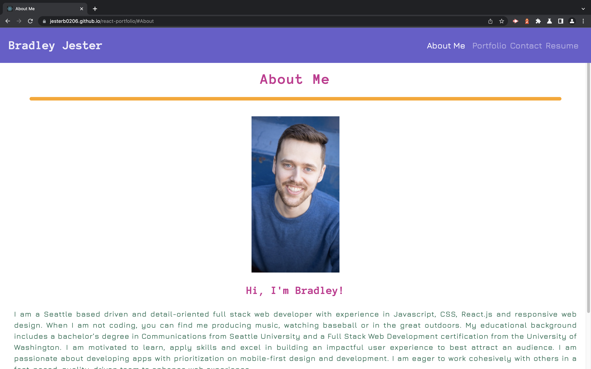
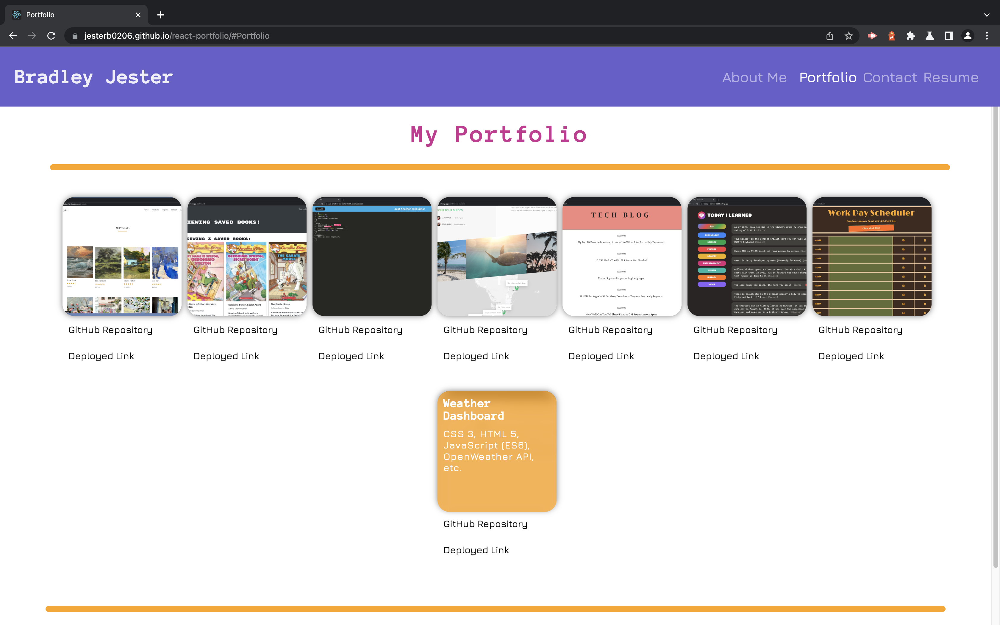
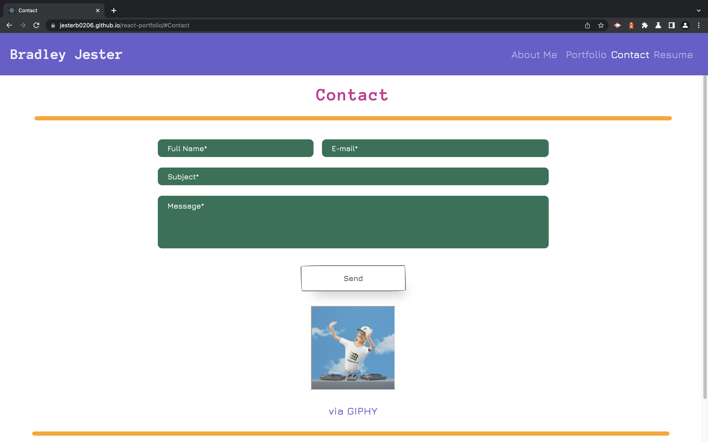
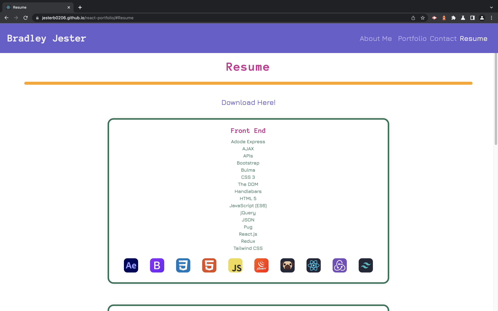

# React Portfolio

 

## License

 

[This application is under the MIT license](https://opensource.org/licenses/MIT)

 

## Deployment Link

 

[Deployment](https://jesterb0206.github.io/react-portfolio/)

 

☝🏻 Click there!

 

## Table of Contents

 

- [React Portfolio](#react-portfolio)
  - [License](#license)
  - [Deployment Link](#deployment-link)
  - [Table of Contents](#table-of-contents)
  - [Description](#description)
  - [Installation](#installation)
  - [Usage](#usage)
  - [Badges](#badges)
  - [Questions](#questions)
    - [GitHub](#github)
    - [Email](#email)

<small><i><a href='http://ecotrust-canada.github.io/markdown-toc/'>Table of contents generated with markdown-toc</a></i></small>

 

## Description

 

This web application is a SPA (Single Page Application) that was built using React.js. There are 4 main sections: `About Me`, `Contact`, `Portfolio` and `Resume`. In the resume section there's a link to download my resume PDF. Also, it's responsive and looks clean across all different device widths. If you wish to contact me simply fill out the contact form or email me at `jesterb@seattleu.edu`. Lastly, if click on the icons in the footer you can view my GitHub, LinkedIn and Instagram accounts.

 

## Installation

 

Clone the repository to your local machine, open your terminal, and navigate to the root folder in the **React Portfolio** repository. To install the necessary dependencies, run `npm i` in your command-line terminal.

 

## Usage

 

1. My React Portfolio consists of 4 main sections: About Me, Contact, Portfolio, and Resume. To navigate to a different section simply click on the name of the section you wish to view in the navigation bar (on smaller devices click on the hamburger menu icon in the upper right-hand corner of the screen to toggle the menu).

 

 

2. In the Portfolio section simply hover over an image to see the name of the project and the tech stack/technologies used to build it. Underneath each project image are links to the deployed project and its corresponding GitHub repository.

 

 

3. If you wish to contact me enter your full name, email address, the subject of your message and the message body in the contact form. Then simply click on the `Send` button.

 

 

4. In the the Resume section you can view a list of my proficiencies and download my resume. To download my resume simply click on the text that reads `Download Here!`.

 

 

## Badges

 

 

 

 

 

 

 

 

 

 

 

## Questions

 

If you have any additional questions, you can reach me at:

 

### GitHub

 

 

[jesterb0206](https://www.github.com/jesterb0206)

 

### Email

 

 

jesterb@seattleu.edu

 
